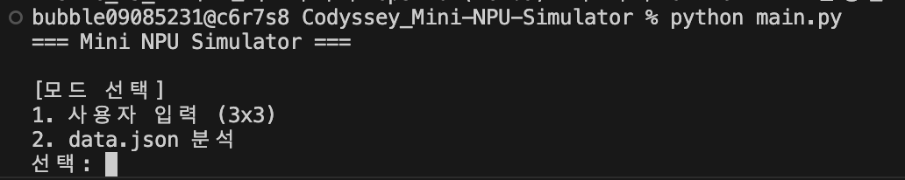
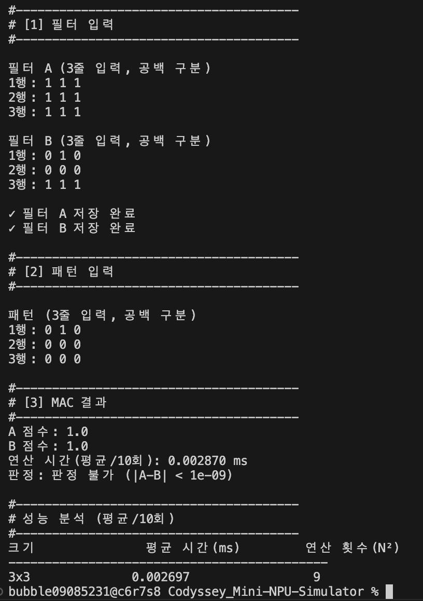
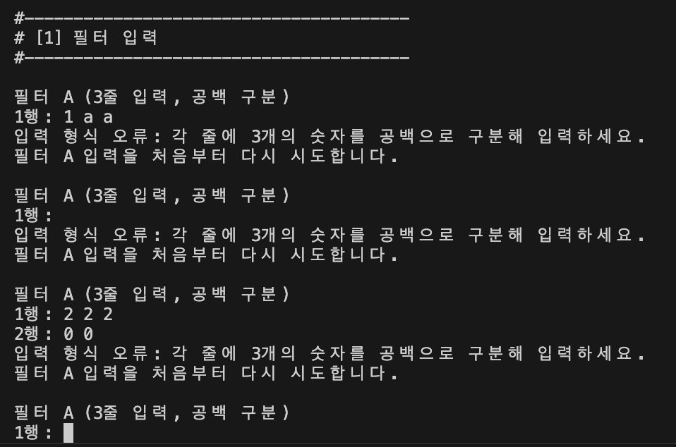
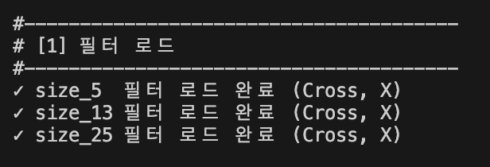
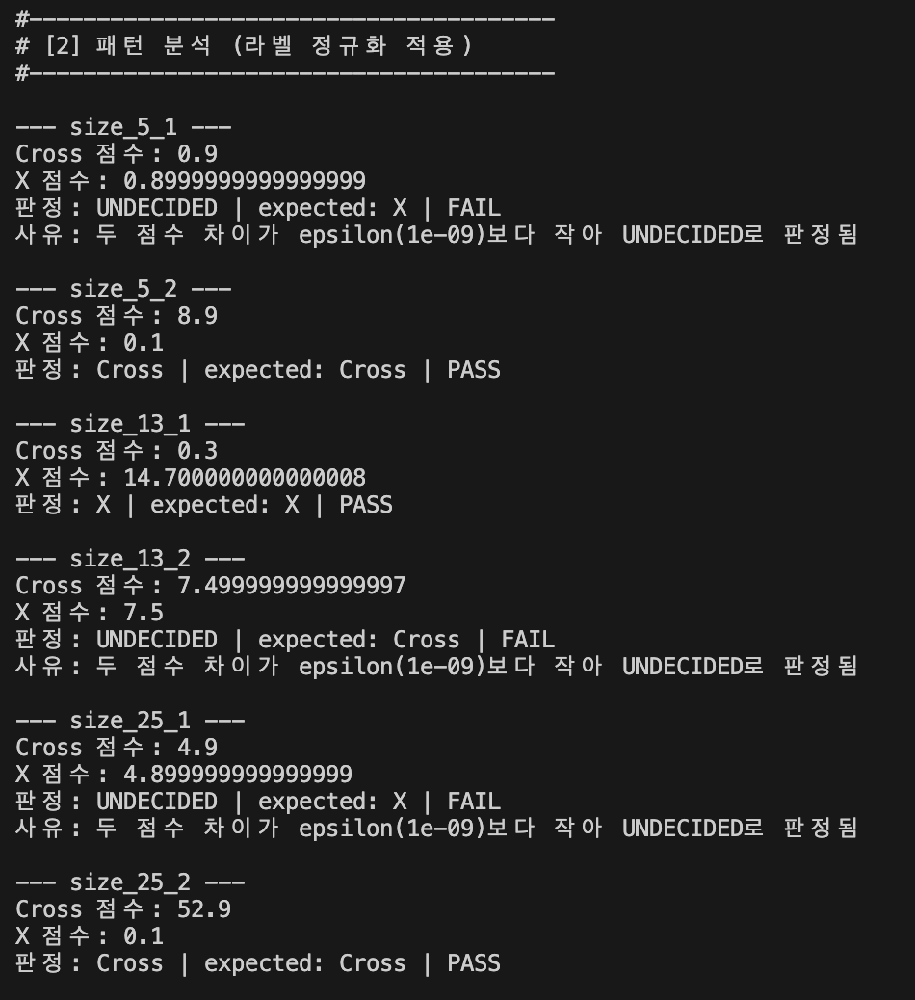
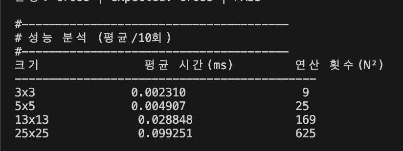
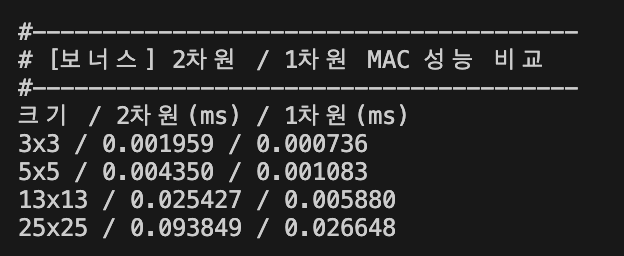
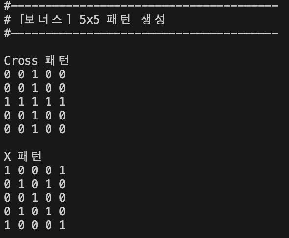
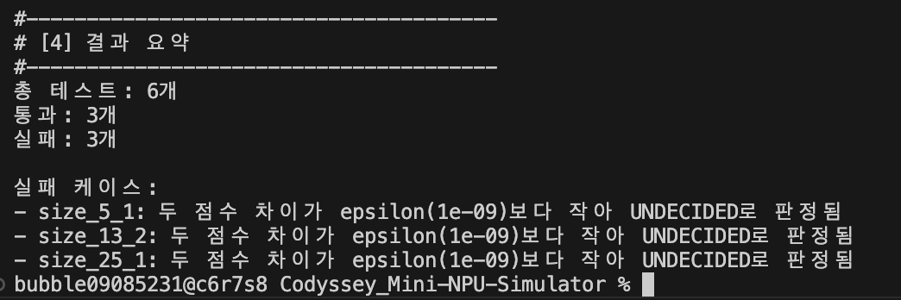

# Mini NPU Simulator

Python 반복문으로 MAC(Multiply-Accumulate) 연산을 직접 구현하여 Cross와 X 패턴을 판별하는 콘솔 프로그램입니다.

본 프로그램은 3×3 사용자 입력 모드와 `data.json` 분석 모드를 제공하며, 5×5, 13×13, 25×25 크기의 패턴을 처리할 수 있습니다. 또한 보너스 과제로 2차원 배열과 1차원 배열의 MAC 성능 비교 및 Cross/X 패턴 자동 생성 기능을 구현합니다.

---

## 1. 실행 방법

`main.py`와 `data.json`을 같은 폴더에 둔 뒤 아래 명령으로 실행합니다.

```bash
python3 main.py
```

실행 후 두 가지 모드 중 하나를 선택합니다.

```text
1. 사용자 입력 (3x3)
2. data.json 분석
```

### 실행 화면



---

## 2. 프로그램 구조

프로그램은 `Matrix` 클래스와 `MiniNPU` 클래스를 중심으로 구성하였으며, 라벨 정규화 기능은 별도의 `normalize_label()` 함수로 분리하였습니다.

### Matrix 클래스

`Matrix` 클래스는 N×N 형태의 2차원 숫자 데이터를 저장하고 행렬 자체와 관련된 기능을 담당합니다.

주요 역할은 다음과 같습니다.

- 2차원 행렬 데이터 저장
- 행렬 크기 저장
- 행/열 개수 검증
- 숫자 데이터 여부 검증
- 특정 위치 값 접근
- 2차원 배열을 1차원 배열로 변환
- Cross 패턴 생성
- X 패턴 생성

패턴과 필터는 모두 같은 N×N 행렬 구조를 사용하기 때문에 행렬과 관련된 기능을 하나의 클래스로 묶었습니다.

### MiniNPU 클래스

`MiniNPU` 클래스는 Mini NPU Simulator의 주요 실행 기능을 담당합니다.

주요 역할은 다음과 같습니다.

- 사용자 입력 처리
- `data.json` 로드
- Cross/X 필터 검증 및 저장
- MAC 연산 수행
- epsilon 기반 점수 판정
- JSON 패턴 분석
- MAC 연산 시간 측정
- 성능 분석 결과 출력
- 2차원/1차원 MAC 성능 비교
- 모드 1 / 모드 2 실행 흐름 관리

정상적으로 검증된 필터는 `self.filters`에 저장합니다.

예를 들어 5×5 필터는 다음과 같이 접근할 수 있습니다.

```python
self.filters[5]["Cross"]
self.filters[5]["X"]
```

## 3. 모드 1 - 사용자 입력 (3×3)

사용자로부터 다음 데이터를 직접 입력받습니다.

1. 3×3 필터 A
2. 3×3 필터 B
3. 3×3 입력 패턴

각 행은 공백으로 구분하여 입력합니다.

예시:

```text
0 1 0
1 1 1
0 1 0
```

### 입력 처리

입력된 문자열은 `split()`을 사용하여 공백 기준으로 나눕니다.

```python
input().split()
```

그 후 `map(float, ...)`을 사용하여 각각의 값을 실수로 변환하고 `list()`로 저장합니다.

```python
row = list(map(float, input().split()))
```

### 입력 검증

다음 오류를 검사합니다.

- 숫자가 아닌 값 입력
- 행의 개수 오류
- 열의 개수 오류

숫자로 변환할 수 없는 값이 입력되면 `ValueError`가 발생하며 `except ValueError`에서 처리합니다.

열의 개수가 맞지 않는 경우에는 `len(row)`을 이용하여 따로 검사합니다.

오류가 발생하면 프로그램을 종료하지 않고 해당 행렬을 처음부터 다시 입력하도록 구현하였습니다.

### 모드 1 정상 실행 스크린샷

> 3×3 Cross/X 필터와 패턴을 정상 입력한 결과 화면을 캡처합니다.




### 모드 1 입력 오류 스크린샷

> 숫자가 아닌 값을 입력하거나 열 개수를 틀리게 입력한 뒤 재입력이 동작하는 화면을 캡처합니다.




---

## 4. MAC 연산

MAC은 Multiply-Accumulate의 약자로, 같은 위치의 값을 곱한 뒤 그 결과를 계속 누적하는 연산입니다.

예를 들어 입력 패턴과 Cross 필터가 다음과 같다고 가정합니다.

```text
입력             Cross 필터

0 1 0            0 1 0
1 1 1            1 1 1
0 1 0            0 1 0
```

각 위치를 곱하면 다음과 같습니다.

```text
0×0 + 1×1 + 0×0
+ 1×1 + 1×1 + 1×1
+ 0×0 + 1×1 + 0×0
```

최종 MAC 점수는 5가 됩니다.

코드에서는 외부 라이브러리를 사용하지 않고 이중 `for` 반복문으로 직접 구현합니다.

```python
for row in range(pattern.size):
    for col in range(pattern.size):
        total += pattern.get(row, col) * filter_matrix.get(row, col)
```

전체 흐름은 다음과 같습니다.

```text
패턴과 필터 입력
      ↓
같은 위치의 값 접근
      ↓
두 값 곱하기
      ↓
total에 누적
      ↓
최종 MAC 점수 반환
```

---

## 5. 모드 2 - data.json 분석

`data.json`의 필터와 패턴을 읽어 일괄 분석합니다.

### 필터 구조

사용하는 필터 크기는 다음과 같습니다.

```text
size_5
size_13
size_25
```

각 크기에는 다음 필터가 존재해야 합니다.

```text
cross
x
```

필터 키는 `normalize_label()`을 이용하여 다음과 같이 변환합니다.

```text
cross → Cross
x     → X
```

### 필터 검증

각 필터를 `Matrix` 객체로 변환한 뒤 다음 내용을 검사합니다.

- N개의 행이 존재하는지
- 각 행에 N개의 값이 존재하는지
- 모든 값이 숫자인지
- Cross 필터가 존재하는지
- X 필터가 존재하는지

Cross 또는 X 필터 중 하나라도 없거나 형식이 잘못된 경우 해당 오류를 `errors` 리스트에 저장합니다.

오류가 하나라도 있으면 해당 크기의 필터는 `self.filters`에 저장하지 않고 `continue`를 사용하여 다음 크기의 필터 검사를 진행합니다.

### 패턴 키 해석

패턴 키는 다음 형식을 사용합니다.

```text
size_{N}_{idx}
```

예:

```text
size_13_2
```

이를 다음과 같이 분리합니다.

```python
parts = key.split("_")
```

결과:

```python
["size", "13", "2"]
```

두 번째 값을 이용하여 패턴 크기를 구합니다.

```python
size = int(parts[1])
```

따라서:

```text
size_13_2 → size = 13
```

이 되고 다음 필터를 사용합니다.

```python
self.filters[13]["Cross"]
self.filters[13]["X"]
```

해당 크기의 필터가 정상적으로 로드되지 않은 경우 해당 패턴을 FAIL 처리하고 다음 패턴으로 넘어갑니다.

### 모드 2 필터 로드 스크린샷




### 모드 2 패턴 분석 스크린샷

> Cross 점수, X 점수, 판정, expected, PASS/FAIL이 보이도록 캡처합니다.




---

## 6. 라벨 정규화

프로그램 내부에서는 다음 두 라벨만 사용합니다.

```text
Cross
X
```

JSON의 라벨 표현은 다음과 같이 표준화합니다.

```text
expected "+"
→ Cross

expected "x"
→ X

filter key "cross"
→ Cross

filter key "x"
→ X
```

라벨을 정규화하지 않는다면 `+`와 `cross`처럼 실제 의미는 같지만 문자열이 다르기 때문에 잘못된 FAIL이 발생할 수 있습니다.

---

## 7. epsilon 기반 점수 비교

컴퓨터는 모든 실수를 정확하게 저장할 수 없습니다.

예를 들어 다음 두 값은 실제로는 거의 같은 값입니다.

```text
0.9000000000000000
0.8999999999999999
```

단순히 `==` 연산자로 비교하면 다른 값으로 처리될 수 있습니다.

따라서 다음 조건을 사용합니다.

```python
abs(score_a - score_b) < 1e-9
```

두 점수의 차이가 `1e-9`보다 작으면 실질적인 동점으로 간주합니다.

모드 1에서는:

```text
판정 불가
```

로 출력합니다.

모드 2에서는:

```text
UNDECIDED
```

로 판정합니다.

---

## 8. 성능 분석

MAC 연산 시간은 `time.perf_counter()`를 사용하여 측정합니다.

측정 구간은 다음과 같습니다.

```text
start
 ↓
MAC 연산
 ↓
end
```

파일 읽기, 사용자 입력, `print()` 등의 I/O 작업은 측정 구간에 포함하지 않습니다.

각 크기마다 MAC 연산을 10회 반복한 뒤 평균 시간을 계산합니다.

성능 분석 대상은 다음과 같습니다.

```text
3×3
5×5
13×13
25×25
```

연산 횟수는 다음과 같습니다.

| 크기 | 연산 위치 수 |
|---|---:|
| 3×3 | 9 |
| 5×5 | 25 |
| 13×13 | 169 |
| 25×25 | 625 |

### 성능 분석 스크린샷

> 3×3, 5×5, 13×13, 25×25의 평균 시간과 N²가 모두 보이도록 캡처합니다.




---

## 9. 시간 복잡도 분석

| 크기    | 평균 시간(ms) | 연산 횟수(N²) |
| ----- | --------: | --------: |
| 3×3   |  0.002310 |         9 |
| 5×5   |  0.004907 |        25 |
| 13×13 |  0.028848 |       169 |
| 25×25 |  0.099251 |       625 |

측정 결과 패턴의 크기가 증가하면서 N²에 해당하는 연산 횟수가
증가하고, 실제 MAC 연산 시간도 함께 증가하는 경향을 확인할 수 있습니다.

예를 들어 5×5에서 25×25로 N이 5배 증가하면 연산 횟수는
25회에서 625회로 증가합니다.

625 / 25 = 25

즉 N이 5배 증가했지만 실제 처리해야 하는 원소의 개수는 25배가 됩니다.

실제 측정 시간도 5×5에서 0.004907ms였던 것이
25×25에서는 0.099251ms로 증가했습니다.

0.099251 / 0.004907 ≈ 20.23

따라서 이 측정에서는 연산 횟수가 25배 증가했을 때 실행 시간은
약 20.23배 증가했습니다.

또한 13×13에서 25×25로 증가하는 경우 연산 횟수는
169회에서 625회로 약 3.70배 증가합니다.

625 / 169 ≈ 3.70

실제 실행 시간은 0.028848ms에서 0.099251ms로 약 3.44배 증가했습니다.

0.099251 / 0.028848 ≈ 3.44

측정 시간의 증가 비율이 N²의 증가 비율과 항상 정확하게 일치하지는
않습니다. 실행 시간이 매우 짧기 때문에 운영체제의 스케줄링,
Python 인터프리터의 실행 오버헤드, CPU 상태 등의 영향을 받을 수 있기 때문입니다.

하지만 N이 증가함에 따라 연산 횟수가 N²으로 증가하고 실제 측정
시간도 이에 따라 증가하는 전체적인 경향을 확인할 수 있습니다.

따라서 코드 구조에 대한 분석과 실제 성능 측정 결과를 함께 고려했을 때
MAC 연산의 시간 복잡도는 O(N²)이라고 분석할 수 있습니다.

N×N 행렬에는 총 N²개의 원소가 존재합니다.

현재 MAC 연산은 이중 반복문을 사용하여 모든 행과 모든 열을 순회합니다.

```python
for row in range(N):
    for col in range(N):
```

따라서 처리하는 위치의 개수는 다음과 같습니다.

```text
N × N = N²
```

각 위치에서 수행하는 곱셈과 덧셈은 상수 시간 연산이므로 전체 시간 복잡도는 다음과 같습니다.

```text
O(N²)
```

N이 증가할수록 MAC 연산 횟수도 N²에 비례하여 증가합니다.

실제 측정 시간은 운영체제 스케줄링, Python 인터프리터, CPU 상태 등에 따라 실행할 때마다 조금씩 달라질 수 있으므로 절대적인 실행 시간보다는 N² 증가와 측정 시간 증가의 관계를 확인하는 것이 중요합니다.

---

# 10. 보너스 과제

## 보너스 1. 1차원 배열을 이용한 MAC 최적화

기본 MAC 연산에서는 2차원 행렬을 사용합니다.

```text
[
  [0, 1, 0],
  [1, 1, 1],
  [0, 1, 0]
]
```

보너스 과제에서는 이 데이터를 1차원 리스트로 변환합니다.

```text
[0, 1, 0, 1, 1, 1, 0, 1, 0]
```

`Matrix.flatten()`을 이용하여 2차원 데이터를 1차원으로 변환합니다.

1차원 MAC은 하나의 인덱스를 사용하여 값을 순서대로 접근합니다.

```python
for i in range(len(pattern_flat)):
    total += pattern_flat[i] * filter_flat[i]
```

2차원 방식과 1차원 방식 모두 N²개의 값을 처리하므로 시간 복잡도 자체는 `O(N²)`로 동일합니다.

하지만 1차원 방식은 이중 인덱스 접근 대신 하나의 인덱스를 사용하므로 데이터 접근 구조가 단순해집니다.

성능 비교의 공정성을 위해 다음 조건을 동일하게 적용합니다.

- 동일한 입력 데이터
- 동일한 필터
- 동일한 반복 횟수 10회
- I/O 시간 제외
- `flatten()` 변환 시간은 MAC 성능 측정 구간에서 제외

### 2차원 / 1차원 MAC 성능 비교 스크린샷

> 실제 실행 결과의 비교 표를 캡처합니다.



### 성능 비교 결과 작성란

| 크기 | 2차원 MAC 평균(ms) | 1차원 MAC 평균(ms) | 비교 |
|---|---:|---:|---|
| 3×3 | 0.001959 | 0.000736 | 1차원 약 2.66배 빠름 |
| 5×5 | 0.004350 | 0.001083 | 1차원 약 4.02배 빠름 |
| 13×13 | 0.025427 | 0.005880 | 1차원 약 4.32배 빠름 |
| 25×25 | 0.093849 | 0.026648 | 1차원 약 3.52배 빠름 |

성능 결과는 실행 환경에 따라 달라질 수 있으므로 실제 측정값을 기준으로 분석합니다.

측정 결과 모든 크기에서 1차원 배열을 사용한 MAC 연산의 평균 시간이
2차원 배열 방식보다 짧게 측정되었다.

3×3에서는 약 2.66배, 5×5에서는 약 4.02배, 13×13에서는 약 4.32배,
25×25에서는 약 3.52배 빠른 결과가 나타났다.

두 방식 모두 N²개의 원소에 대해 곱셈과 누적 연산을 수행하므로
시간 복잡도는 O(N²)로 동일하다.

하지만 이번 구현의 2차원 방식은 행과 열을 이용한 중첩 반복과
`get()` 메서드를 통한 값 접근을 사용하고, 1차원 방식은 하나의 인덱스로
리스트의 값을 직접 순차 접근한다.

따라서 1차원 방식에서 Python 코드 수준의 추가적인 접근 과정이 줄어들어
실제 측정 시간이 더 짧게 나타난 것으로 볼 수 있다.

단, 실행 시간은 CPU 상태와 Python 실행 환경 등에 영향을 받으므로
1차원 배열이 항상 동일한 비율로 빠르다고 일반화할 수는 없다.

---

## 보너스 2. Cross / X 패턴 생성기

크기 N을 이용하여 N×N Cross와 X 패턴을 자동 생성할 수 있도록 구현합니다.

### Cross 생성 규칙

가운데 행 또는 가운데 열이면 1을 저장합니다.

```python
if row == center or col == center:
```

5×5 Cross 예:

```text
0 0 1 0 0
0 0 1 0 0
1 1 1 1 1
0 0 1 0 0
0 0 1 0 0
```

### X 생성 규칙

주대각선 또는 반대 대각선이면 1을 저장합니다.

```python
if row == col or row + col == size - 1:
```

5×5 X 예:

```text
1 0 0 0 1
0 1 0 1 0
0 0 1 0 0
0 1 0 1 0
1 0 0 0 1
```

생성된 `Matrix` 객체는 MAC 연산과 성능 분석에 다시 사용할 수 있습니다.

### 패턴 생성기 스크린샷

> Cross와 X 자동 생성 결과가 보이도록 캡처합니다.




---

# 11. 결과 리포트

제공된 `data.json`에는 총 6개의 패턴 테스트가 있으며 `size_5`, `size_13`, `size_25`에 각각 2개씩 존재합니다.

라벨 정규화를 적용하면 expected의 `+`는 `Cross`, `x`는 `X`로 통일되기 때문에 문자열 표현의 차이로 발생할 수 있는 잘못된 FAIL을 방지할 수 있습니다.

`size_5_2`는 Cross 점수가 8.9, X 점수가 0.1이므로 Cross로 판정되어 PASS가 됩니다.

`size_13_1`은 Cross 점수가 0.3, X 점수가 14.7이므로 X로 판정되어 PASS가 됩니다.

`size_25_2`는 Cross 점수가 52.9, X 점수가 0.1이므로 Cross로 판정되어 PASS가 됩니다.

반면 `size_5_1`은 Cross 점수와 X 점수가 epsilon 범위 내에서 같기 때문에 `UNDECIDED`로 처리됩니다. expected는 X이므로 FAIL입니다.

`size_13_2` 역시 Cross와 X 점수가 epsilon 범위 내에서 같아 `UNDECIDED`가 되고 expected Cross와 일치하지 않아 FAIL입니다.

`size_25_1` 역시 두 점수가 epsilon 범위 내에서 같아 `UNDECIDED`가 되고 expected X와 일치하지 않아 FAIL입니다.

따라서 제공된 원본 `data.json`을 수정하지 않고 epsilon 기반 동점 정책을 적용하면 총 6개 중 PASS 3개, FAIL 3개가 됩니다.

이 세 FAIL은 프로그램 로직의 오류가 아니라 Cross와 X의 MAC 점수가 사실상 동일한 데이터에서 동점 처리 규칙을 적용한 결과입니다.

부동소수점 계산에서는 작은 표현 오차가 발생할 수 있기 때문에 `==`로 직접 비교하지 않고 epsilon을 사용하였습니다.

N×N MAC 연산은 모든 위치를 한 번씩 처리하므로 시간 복잡도는 `O(N²)`입니다.

3×3은 9개, 5×5는 25개, 13×13은 169개, 25×25는 625개의 위치를 처리합니다.

성능 측정에서는 각 크기를 10회 반복하여 평균을 구함으로써 한 번의 측정값만 사용하는 것보다 실행 환경의 순간적인 영향을 줄였습니다.

보너스 과제의 1차원 MAC도 N²개의 값을 처리하기 때문에 이론적인 시간 복잡도는 `O(N²)`로 동일하지만 데이터 접근 방식이 단순해지는 차이가 있습니다.

실제 2차원/1차원 성능 차이는 실행 환경에 따라 달라질 수 있으므로 프로그램에서 직접 측정한 결과를 기준으로 비교합니다.

---

## 실행 결과

### 프로그램 시작 화면


### 모드 1 - 3×3 사용자 입력 및 MAC 연산 결과


### 모드 1 - 잘못된 입력 예외 처리


### 모드 2 - data.json 필터 로드


### 모드 2 - JSON 패턴 분석 및 PASS/FAIL


### 크기별 MAC 성능 분석


### 보너스 1 - 2차원 / 1차원 MAC 성능 비교


### 보너스 2 - Cross / X 패턴 생성기


### 최종 결과 요약

